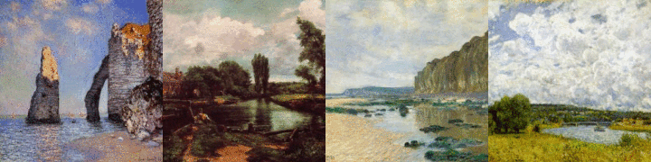
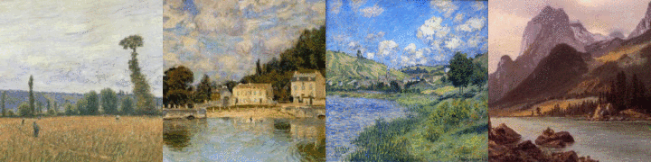
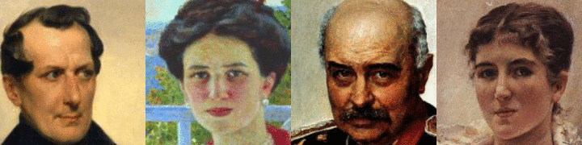

# Art2Real
This repository contains the reference code for the paper _[Art2Real: Unfolding the Reality of Artworks via Semantically-Aware Image-to-Image Translation](https://arxiv.org/pdf/1811.10666)_ (CVPR 2019).

Please cite with the following BibTeX:

```
@inproceedings{tomei2019art2real,
  title={{Art2Real: Unfolding the Reality of Artworks via Semantically-Aware Image-to-Image Translation}},
  author={Tomei, Matteo and Cornia, Marcella and Baraldi, Lorenzo and Cucchiara, Rita},
  booktitle={Proceedings of the IEEE/CVF Conference on Computer Vision and Pattern Recognition},
  year={2019}
}
```

<p align="center">

</p>

## Requirements

This code is built on top of the [Cycle-GAN source code](https://github.com/junyanz/pytorch-CycleGAN-and-pix2pix).

The required Python packages are:
* torch>=0.4.1
* torchvision>=0.2.1
* dominate>=2.3.1
* visdom>=0.1.8.3
* [faiss](https://github.com/facebookresearch/faiss/blob/master/INSTALL.md) 

## Pre-trained Models

* **Monet2Photo** [[Checkpoints]](https://drive.google.com/drive/folders/1XciFP86aKuYoWUWKXgGaBVrZrWx6vjxe?usp=sharing) [[Dataset]](https://ailb-web.ing.unimore.it/publicfiles/drive/CVPR%202019%20-%20Art2Real/datasets/monet2photo.zip)
* **Landscape2Photo** [[Checkpoints]](https://drive.google.com/drive/folders/1rmYKPYFu3FGwfrkAAGaqn1G7R-fODj41?usp=sharing) [[Dataset]](https://ailb-web.ing.unimore.it/publicfiles/drive/CVPR%202019%20-%20Art2Real/datasets/landscape2photo.zip)
* **Portrait2Photo** [[Checkpoints]](https://drive.google.com/drive/folders/12Vr6oceBzi4NWRZsyF7eUg-3WTZdh8Lv?usp=sharing) [[Dataset]](https://ailb-web.ing.unimore.it/publicfiles/drive/CVPR%202019%20-%20Art2Real/datasets/portrait2photo.zip)

Download pre-trained models and place them under the checkpoint folder. For example, when downloading the monet2photo checkpoints, place them under the folder `./checkpoints/monet2photo/`.

## Test

Run `python test.py` using the following arguments:

| Argument | Possible values |
|------|------|
| `--dataroot` | Dataset root folder containing the `testA` directory |
| `--name ` | `monet2photo`, `landscape2photo`, `portrait2photo` |
| `--num_test ` | Number of test samples |

For example, to reproduce the results of our model for the first 100 test samples of the landscape2photo setting, use:
```
python test.py --dataroot ./datasets/landscape2photo --name landscape2photo --num_test 100
```


## Training

**Note: for simplicity, the released training code does not include the regular update of semantic masks from the generated images. In this code, original painting masks are kept fixed.**

To run the training code, download the following zip folder containing RGB patches of real landscapes, FAISS indexes and masks from Monet and landscape paintings:
* [[data for patch retrieval]](https://ailb-web.ing.unimore.it/publicfiles/drive/CVPR%202019%20-%20Art2Real/data_for_patch_retrieval.zip) 

Place it under the root code folder (*i.e.* `./data_for_patch_retrieval`).

Run `python train.py` using the following arguments:

| Argument | Possible values |
|------|------|
| `--dataroot` | Dataset root folder containing the `trainA` and `trainB` directories |
| `--name ` | Name of the experiment. It decides where to store samples and models |
| `--no_flip ` | Since artistic masks are fixed, we do not random flip images during training |
| `--patch_size_1 ` | Height and width of the first scale patches |
| `--stride_1 ` | Stride of the first scale patches |
| `--patch_size_2 ` | Height and width of the second scale patches |
| `--stride_2 ` | Stride of the second scale patches |
| `--patch_size_3 ` | Height and width of the third scale patches |
| `--stride_3 ` | Stride of the third scale patches |
| `--which_mem_bank ` | `./data_for_patch_retrieval` |
| `--artistic_masks_dir ` | `masks_of_artistic_images_monet`, `masks_of_artistic_images_landscape` |
| `--preload_mem_patches ` | If specified, load all RGB patches in memory |
| `--preload_indexes ` | If specified, load all FAISS indexes in memory |

* Required RAM for both RGB patches and FAISS indexes: ~40 GB.

* Specify only `--patch_size_1 ` and `--stride_1 ` to run the single-scale version.

For example, to train the model on the landscape2photo setting, use:
```
python train.py --dataroot ./datasets/landscape2photo --name landscape2photo --no_dropout --display_id 0 --no_flip --niter_decay 100 --no_flip --patch_size_1 16 --stride_1 6 --patch_size_2 8 --stride_2 5 --patch_size_3 --stride_3 4 --which_mem_bank ./data_for_patch_retrieval --artistic_masks_dir masks_of_artistic_images_landscape --preload_mem_patches --preload_indexes
```

<p align="center">


</p>

